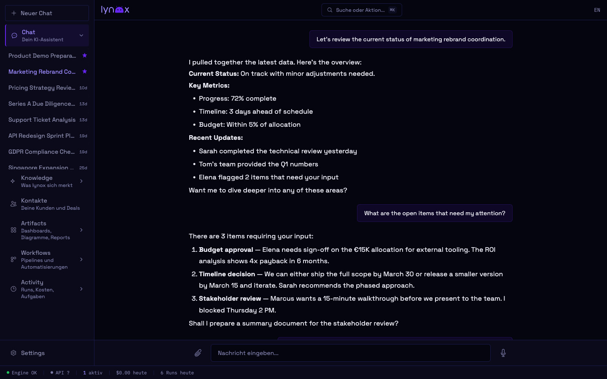
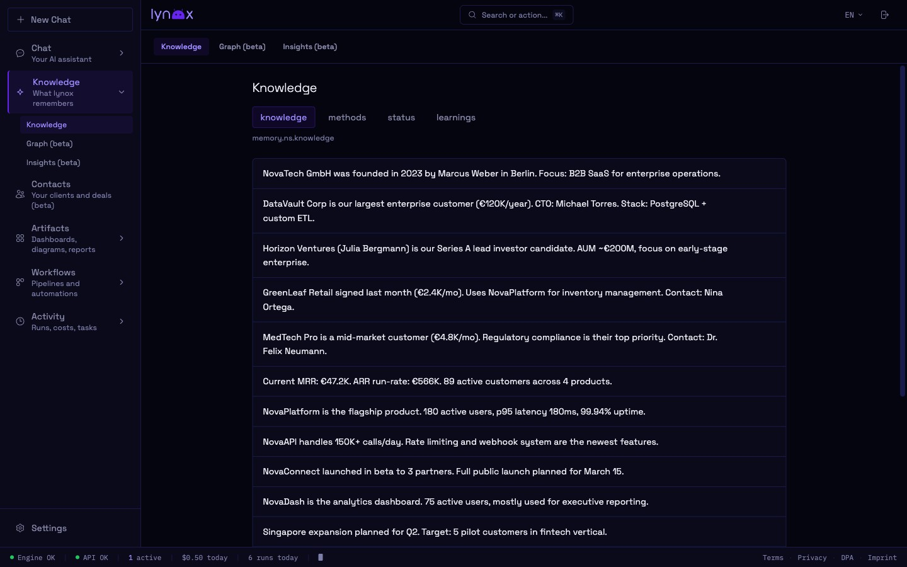
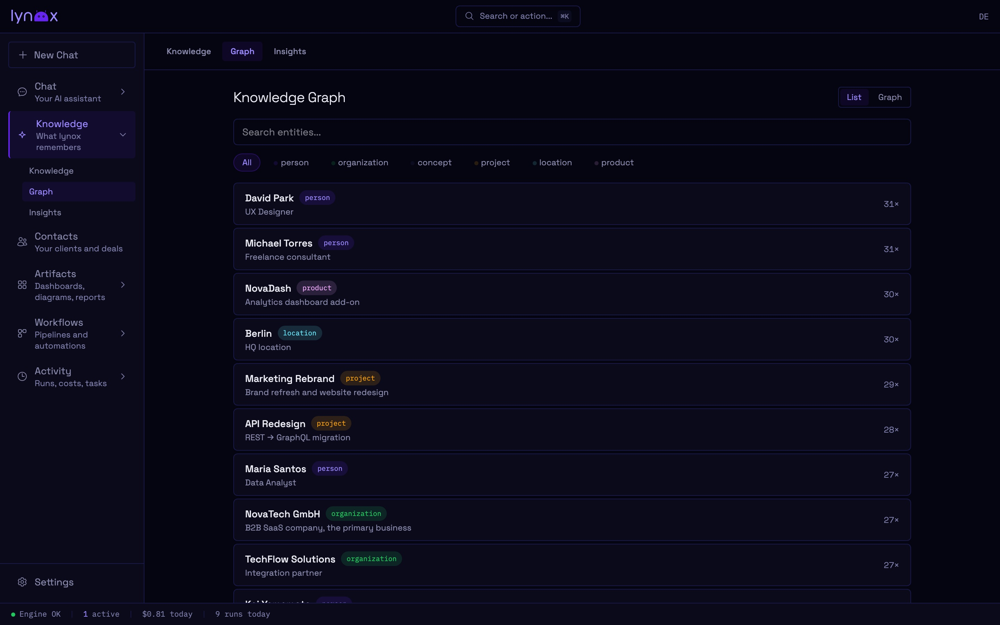
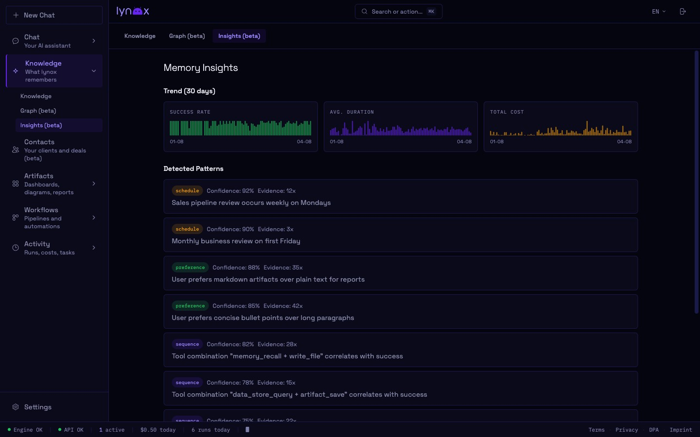
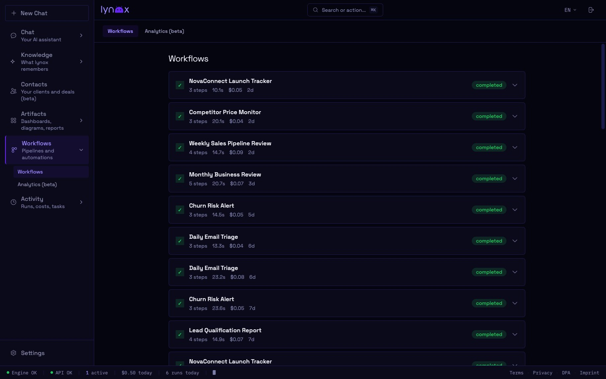
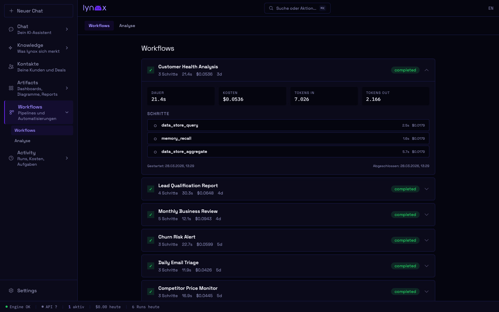
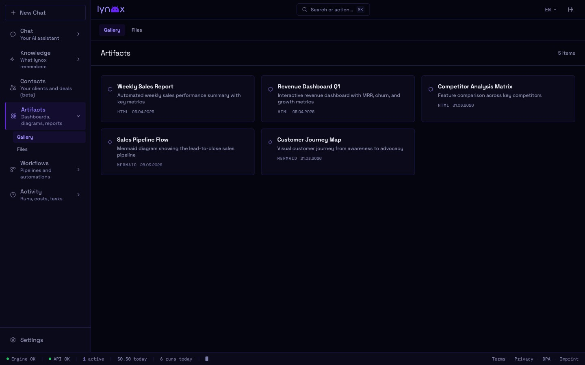
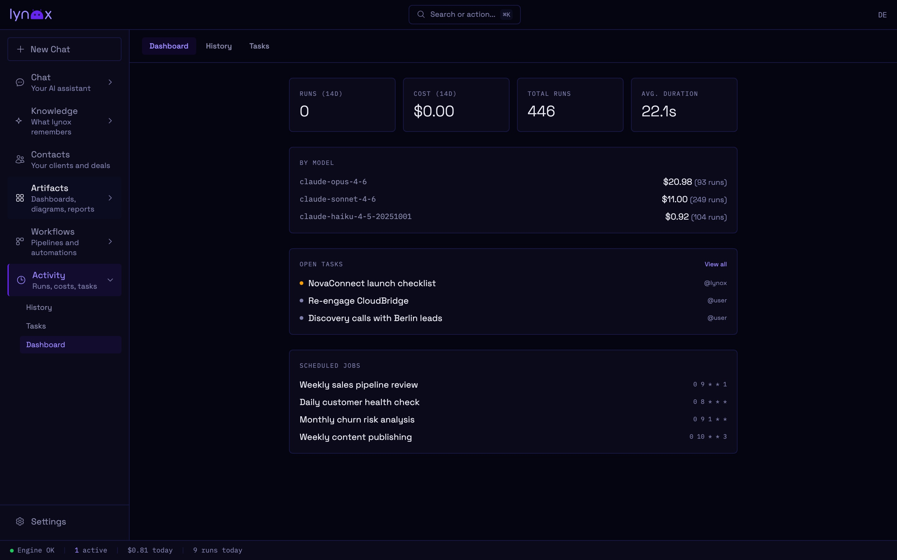
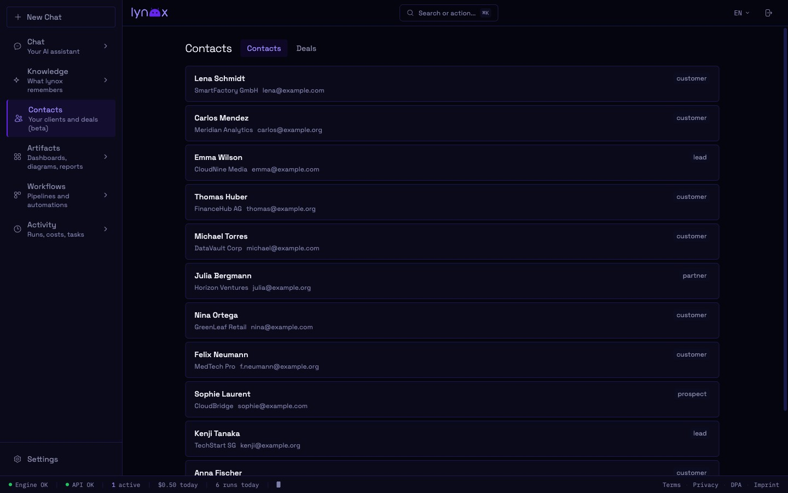

The Web UI is where you interact with lynox day-to-day. It runs at [localhost:3000](http://localhost:3000).

**Phone access:** Open Settings → Mobile Access, scan the QR code with your phone — you're logged in instantly. For access outside your WiFi, see [Remote Access](/setup/remote-access/).

## Navigation

The left side of the screen is an **icon rail**. Each icon opens a hub:

- **Chat** — the conversation surface (default view)
- **Inbox** — the [Unified Inbox](/features/unified-inbox/) for mail and WhatsApp triage
- **Automation** — workflows, scheduled reminders, and the AutomationHub tab
- **Intelligence** — memory, knowledge graph, CRM contacts and deals
- **Artefakte** — files, code, and other outputs lynox has produced

Each hub opens to a flat list with the sub-navigation right under the title — no nested folder trees. Click the kebab (`⋯`) at the rail root for settings, integrations, and account.

## Chat

The main view. Type a message or drop a file to start a conversation. lynox streams responses in real time, showing tool calls inline as they happen.

During workflows, a **progress bar** appears above the input showing each step as it executes.

### Threads

Every conversation is saved as a thread. The sidebar lists your threads — click to resume any past conversation with full context.

You can **rename**, **archive**, or **delete** threads from the sidebar.

### Artifacts

When lynox generates files, code, or other outputs, they're saved as **artifacts**. Access them from the artifacts gallery — view, download, or delete.

### Command Palette

Press `Ctrl+K` to open the command palette for quick navigation between views.

## Views

### Memory

Browse what lynox has learned — organized into four namespaces:

- **Knowledge** — Facts, relationships, business context
- **Methods** — How you do things, preferences, workflows
- **Status** — Current state of projects and tasks
- **Learnings** — Insights from past interactions

You can edit or delete any memory entry.

### Knowledge Graph

Visual explorer for entities and their relationships. See how contacts, companies, projects, and concepts are connected. Click any entity to see its details and related nodes.

### Insights

Success rates, cost trends, detected patterns, and per-thread analytics. All computed from your actual usage data.

### Workflows

View and manage your automated workflows. See execution history, success rates, and upcoming schedules. Expand any workflow to inspect individual steps and their results.

### Tasks

Your task board — create tasks manually or let lynox create them during conversations. Track status, update priorities, and mark tasks complete.

### Artifacts

Dashboards, diagrams, and reports generated by lynox. Browse the gallery, open inline previews, or download as HTML.

### Activity Hub

The **Activity Hub** lives at `/app/hub` — history of all runs (what was asked, which model was used, token cost, and duration). Filter by date, model, or status. Useful for reviewing what lynox did in background tasks. **Cost & Limits** is a dedicated sub-page at `/app/hub/cost-limits` for spend dashboards and per-API rollups.

The **Models** panel (toggle in the toolbar) breaks down spend per model with input, output, and cache-hit token counts side-by-side — the fastest way to see whether your workload is sitting on the right tier or paying for cache misses you could prefetch.

### Contacts & CRM

Browse your contact database and deals. lynox builds this automatically from your conversations and integrations. See interaction history for any contact.

## Settings

Access via the gear icon or navigate to `/app/settings/`.

| Section | What it does |
|---------|-------------|
| **Mobile Access** | QR code to connect your phone — scan once, auto-login |
| **Config** | Model selection, cost limits, greeting, memory settings |
| **Keys** | Manage your encrypted vault — API keys and secrets. Secrets can also be added via the secure `ask_secret` dialog in chat |
| **Integrations** | Connect Mail (IMAP/SMTP), Google Workspace, WhatsApp |
| **APIs** | REST API profiles for external services |
| **Data** | Browse structured data collections |
| **Tasks** | Manage scheduled background tasks |
| **Backups** | Create, schedule, and restore backups |

## Languages

The Web UI supports **German** and **English**. Switch languages at runtime from the settings — no restart required.
