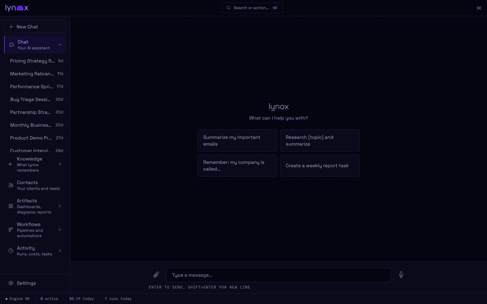

## Prerequisites

- **Node.js 22+** — [nodejs.org](https://nodejs.org)
- **An LLM provider** — one of:
  - **Anthropic API Key** (default) — [console.anthropic.com](https://console.anthropic.com/settings/keys)
  - **AWS Bedrock** — for EU data residency
  - **Google Vertex AI** — for GCP-native organizations
  - **Local model via LiteLLM** — for full data control

Most users start with Anthropic. You can switch providers anytime in Settings. See [LLM Providers](/daily-use/llm-providers/) for details.

Anthropic charges per usage — a typical business day costs **$1–5**. You can set spending limits in their console and in lynox.

## Install

### Option 1: npx (quickest)

```bash
npx @lynox-ai/core
```

Starts the setup wizard on first run, then opens the Web UI.

### Option 2: Docker (recommended for always-on)

```bash
docker run -d --name lynox -p 3000:3000 \
  -e ANTHROPIC_API_KEY=sk-ant-... \
  -e LYNOX_HTTP_SECRET=your-access-token \
  -v ~/.lynox:/home/lynox/.lynox \
  --restart unless-stopped \
  ghcr.io/lynox-ai/lynox:webui
```

Open [localhost:3000](http://localhost:3000) and enter your access token to log in.

:::tip[Alternative providers]
Using AWS Bedrock or a local model? Replace the API key line with your provider config:

```bash
# AWS Bedrock (EU)
-e LYNOX_LLM_PROVIDER=bedrock -e AWS_REGION=eu-central-1 \
-e AWS_ACCESS_KEY_ID=AKIA... -e AWS_SECRET_ACCESS_KEY=... \

# Local model via LiteLLM
-e LYNOX_LLM_PROVIDER=custom -e ANTHROPIC_BASE_URL=http://host.docker.internal:4000 \
```

You can also change the provider later in **Settings → Config**. See [LLM Providers](/daily-use/llm-providers/).
:::

:::tip[Token from setup guide]
The [setup guide](https://lynox.ai/getting-started) generates a secure token for you and includes it in the command. If you omit `LYNOX_HTTP_SECRET`, one is auto-generated — find it with `docker logs lynox`.
:::

### Option 3: Clone & run

```bash
git clone https://github.com/lynox-ai/lynox.git
cd lynox
pnpm install
pnpm run dev
```

## Setup Wizard

On first run, the wizard guides you through:

1. **Prerequisites check** — Node.js version, directory permissions, network connectivity
2. **API Key** — Paste your Anthropic API key (starts with `sk-`). It's verified immediately.
3. **Encryption** — A vault key is generated automatically. The wizard offers to add it to your shell profile so it loads on every session.

Everything is saved to `~/.lynox/config.json`. The vault key goes into `~/.lynox/.env`.

:::caution[Save your vault key]
Your vault key encrypts all stored API keys and backups. **Save it to a password manager now** — if you lose it, encrypted data cannot be recovered.

You can view and copy your vault key anytime in **Settings → Config → Security**.

For Docker users: pass it as `-e LYNOX_VAULT_KEY=your-key` so it persists across container restarts.
:::

## First Run

After setup, lynox opens the Web UI at [localhost:3000](http://localhost:3000).



Try something:

- *"Summarize this PDF"* — drop a file into the chat
- *"What happened in my Gmail today?"* — after connecting Google Workspace
- *"Monitor example.com every day and alert me if something changes"*
- *"Create a weekly report template for my team"*

lynox remembers context across conversations. The more you use it, the more it learns about your business.

## Entry Modes

| Mode | Command | Use case |
|------|---------|----------|
| **Web UI** | `npx @lynox-ai/core` | Primary interface — chat, settings, integrations |
| **One-shot** | `npx @lynox-ai/core "your task"` | Run a single task from the terminal |
| **Docker** | `docker run ... ghcr.io/lynox-ai/lynox:webui` | Always-on with Web UI |

## HTTPS & Remote Access

When running lynox on a server, add HTTPS so the access token isn't transmitted in plaintext:

When using a reverse proxy, set `ORIGIN` so session cookies get the correct `Secure` flag:

```bash
docker run ... -e ORIGIN=https://yourdomain.com ghcr.io/lynox-ai/lynox:webui
```

**Caddy** (automatic HTTPS):
```bash
caddy reverse-proxy --from yourdomain.com --to localhost:3000
```

**Cloudflare Tunnel** (no open ports needed):
```bash
cloudflared tunnel --url http://localhost:3000
```

## Validate Your Setup

After starting lynox, verify everything is working:

1. **Container running** — `docker ps` shows `lynox` with status `Up` and `(healthy)`
2. **Access token visible** — `docker logs lynox` shows the access token block
3. **Web UI loads** — Open [localhost:3000](http://localhost:3000) and enter the token
4. **Engine connected** — Status bar (bottom) shows a green dot next to "Engine"
5. **API key works** — Send a test message like "Hello" — you get an AI response
6. **Data persists** — `ls ~/.lynox/` shows `config.json`, `.env`, and database files

If step 5 fails with "API Key Invalid", check your `ANTHROPIC_API_KEY`. If step 6 shows an empty directory, your volume mount isn't working (see below).

## Common Mistakes

:::danger[Missing volume mount]
Without `-v ~/.lynox:/home/lynox/.lynox`, your vault key and all data are lost when the container restarts. This is the single most common cause of data loss. The entrypoint prints a warning if it detects this.
:::

**Wrong image tag** — `ghcr.io/lynox-ai/lynox:latest` is the engine-only image (Telegram + MCP, no Web UI). For the Web UI, use `:webui`:
```bash
docker run ... ghcr.io/lynox-ai/lynox:webui
```

**API key not set** — The container starts without `ANTHROPIC_API_KEY`, but AI responses are disabled. The Web UI loads normally — check the status bar for "API Key Invalid".

**Port already in use** — If port 3000 is taken, map to a different host port:
```bash
docker run -p 8080:3000 ...
```

**Vault key lost** — If you see "Vault key generated" on every restart, your volume isn't persisting. Stop the container, ensure `~/.lynox` exists and is writable, then restart.

## Troubleshooting

**Container won't start** — Check `docker logs lynox`. Most common cause: missing or invalid API key.

**"API key rejected"** — For Anthropic: must start with `sk-ant-` and be active in [console.anthropic.com](https://console.anthropic.com/). For Bedrock/Vertex: check your cloud credentials. For Custom: verify your proxy URL is reachable.

**Can't access Web UI** — Check that port 3000 is open. On a VPS, you may need to allow it in your firewall.

**Lost access token** — Set a new one: `docker rm -f lynox` and re-run with a new `-e LYNOX_HTTP_SECRET=...`. Or omit it entirely to auto-generate one visible via `docker logs lynox`.

**Telegram bot not responding** — Check that no other instance uses the same bot token.

## Next Steps

- [Web UI Guide](/daily-use/web-ui/) — Learn the interface
- [Configuration](/daily-use/configuration/) — Customize model, cost limits, and more
- [LLM Providers](/daily-use/llm-providers/) — Use AWS Bedrock, Vertex AI, or local models
- [Telegram](/integrations/telegram/) — Mobile access via Telegram bot
- [Google Workspace](/integrations/google-workspace/) — Connect Gmail, Calendar, Drive
- [Docker Deployment](/daily-use/docker/) — Production setup with Docker Compose
